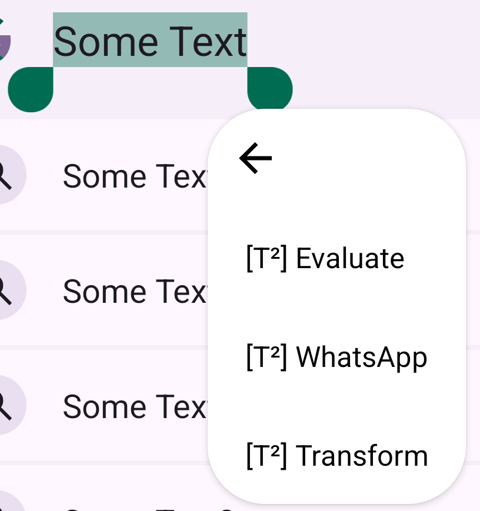
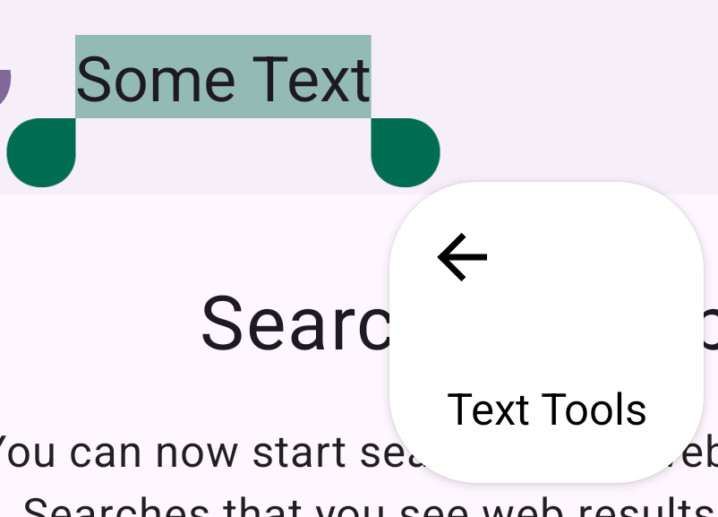
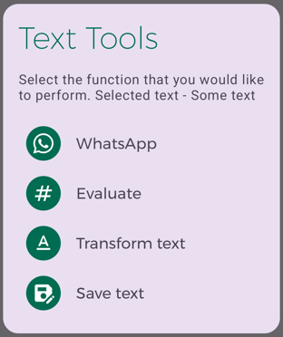

# Text Tools

Collection of useful text related tools that can be accessed from the context menu that appears on text selection. The feature list will keep on growing. Let me know if you have any ideas.

### Current Features
- __Text unsaved numbers in WhatsApp__ - Often we find ourselves needing to text/send file/share location to someone for temporary purposes (if you ask me, I face this a lot in situations where I go to a printing centre where they ask me to share the file that I want to print over WhatsApp, so I have to save their contact, refresh my WhatsApp contact list and then send them). Having a context menu option to directly open a WhatsApp chat from their phone number would save a lot of time and keep your phonebook clean, right?

- __Evaluate mathematical expressions inline__ - We may often find ourselves to mathematically calculate something while texting someone (probably while making plans). Having an option to perform math calculations in line without needing to open calculator could save time.

- __Transform text__ - Transform the selected text inline. Supported transformations include changing the case, wrapping it with text etc.

### Variants
Since one of the functions of the app is to provide additional options in the text selection context menu, some users may want all of the options to be available at once for easy access while others may prefer a clean context menu. For this, we have 2 variants of the app. Functionalities remain same across all the variants.
- __Multiple Options__ (default) - This variant shows all of the supported options at once in the text selection context menu.

Helpful if fast access to the options is required. In order to download this, download the _app-release.apk_ from [releases page](https://github.com/corphish/TextTools/releases/latest).

- __Single Option__ - This variant shows a single option in the text selection context menu which reveals all the supported functions when clicked.

Helpful if the text selection context menu needs to be clean and clutter free. In order to download this, download the _app-release-single.apk_ from [releases page](https://github.com/corphish/TextTools/releases/latest).

### Installation warning
While installing the app (you have to sideload), Google Play may block the installation saying it has never seen the app before. While it is true (from Google Play POV), you can proceed with installing the app. If you have doubts about the app being malicious, you are free to verify the same from the source code (it would not be open-source if the app was malicious in the first place, right?).

### Issues
Issues may be observed as in the contextual menu options may not be available inside certain apps, or the functionalities may not work as expected. In such cases, kindly raise issue in this Github repo.

### Translations
If you would like to contribute to this project by translating the various text shown in the app, you may do so by heading over to the [Crowdin Project](https://crowdin.com/project/text-tools).

### Support
If you like my work and would like to support me, you can help to [buy me un gelato](https://www.paypal.com/paypalme/corphish).